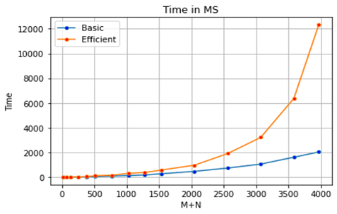

# CSCI-570-Analysis-of-Algorithms

Final project for CSCI 570 - Analysis of Algorithms

To view the project description, click **[here](contents/CSCI570_Spring_FinalProject.pdf)**.

# Summary
We used Dynamic Programming for the basic solution and DP with Divide and Conquer for the memory-efficient solution.

## Graph1 – Memory vs Problem Size (M+N)


### Nature of the Graph (Logarithmic/ Linear/ Exponential)

- Basic: Polynomial
- Efficient: Linear

### Explanation:

The space complexity of Basic algorithm: O(mn)

- For the basic algorithm, as problem size goes up, the used memory grows rapidly. We used a whole two-dimensional array to store values of the solution. Thus, as the problem size grows up, the used memory for the two-dimensional array grows up as well.

The space complexity of Efficient algorithm O(m+n)

- On the other hand, we can bring the space requirement down to linear O(m+n). We applied recursive calls sequentially and reused the working space from one call to the next. Thus, since we only worked on one recursive call at a time, the total space is O(m+n). As a result, the above line of efficient algorithm graph increases linearly closer to the x-axis than the basic one.

## Graph2 – Time vs Problem Size (M+N)



### Nature of the Graph (Logarithmic/ Linear/ Exponential)

- Basic: Polynomial
- Efficient: Polynomial

### Explanation:

The time complexity of Basic algorithm: O(mn)

- We iterated through the whole characters of two generated strings, so it takes O(m*n) time. Thus, as you can see, the above graph has the shape of y = k*m\*n which is polynomial. As the problem size (M+N) is increased, the total time is increased as well.

The time complexity of Efficient algorithm: O(mn)

- Likewise, we iterated through the whole characters of two generated strings, so it also takes O(m\*n) time. However, we need more workload to use the Divide and conquer algorithm. For example, we should split the problem into subproblems and combine them again. Therefore, the graph of the memory-efficient algorithm increases more steeply than the basic one.

# How to execute

To run codes, download the sources 'basic_3.py' and 'efficient_3.py'. Then locate a sample input data into the same location with the code.

```
python3 basic_3.py "$1" "$2"
```

The first argument, '$1', is the name of input file. The second argument, '$2', is the name of output file. For example, you can run as following:

```
python3 basic_3.py input.txt output.txt
```

Running this command will generate 'output.txt' file. (If there is no such file, it will create automatically. If it already exists, it will overwrite the contents of the file.)
Otherwise, you can just modify shell script files in the 'scripts' folder and run each of them.
